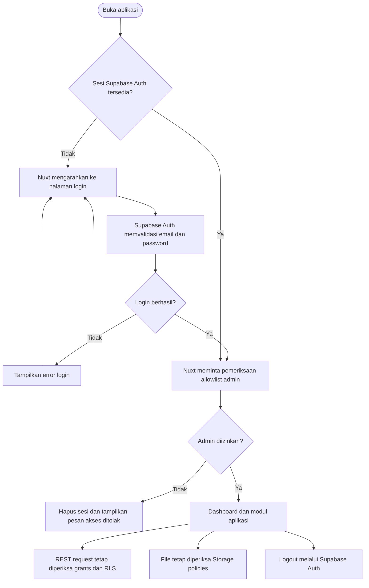
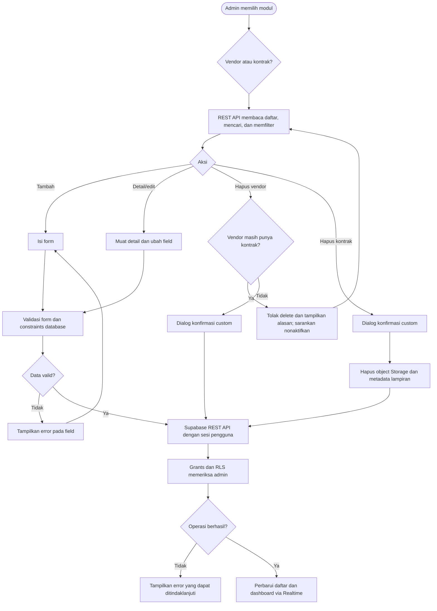
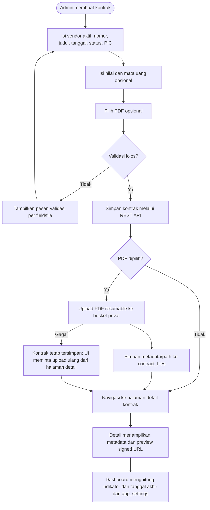
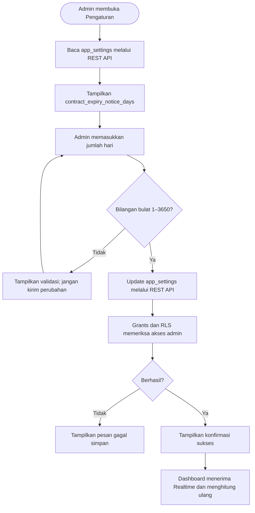

# Flowcharts

## Login dan otorisasi



## CRUD vendor dan kontrak



## Lampiran dan realtime

```mermaid
sequenceDiagram
    actor Admin
    participant UI as Nuxt UI
    participant SDK as supabase-js
    participant API as Supabase REST API
    participant DB as PostgreSQL + RLS
    participant Storage as Supabase Storage + policies
    participant RT as Supabase Realtime

    Admin->>UI: Simpan form vendor/kontrak
    UI->>SDK: Insert/update row dengan sesi admin
    SDK->>API: REST request + publishable key + session
    API->>DB: Cek grants, RLS, foreign key, constraints
    DB-->>API: Row berhasil disimpan atau error
    API-->>SDK: Respons REST
    SDK-->>UI: Data hasil CRUD

    Admin->>UI: Pilih logo atau PDF
    UI->>Storage: Upload file dengan sesi admin; PDF memakai resumable TUS
    Storage->>Storage: Cek bucket policy, MIME, dan ukuran
    Storage-->>UI: Object path
    UI->>API: Simpan path dan metadata file
    API->>DB: Cek RLS dan foreign key

    DB-->>RT: Perubahan tabel yang dipublish
    RT-->>UI: Event perubahan
    UI->>API: Refetch data terbaru
```

## Siklus kontrak



## Pengaturan ambang pengingat


